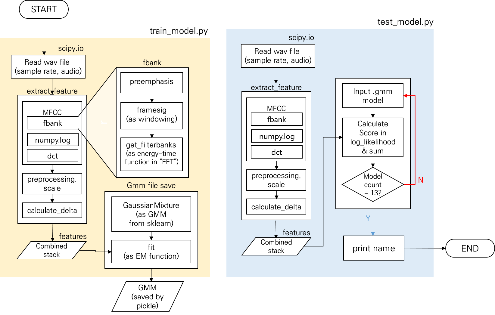
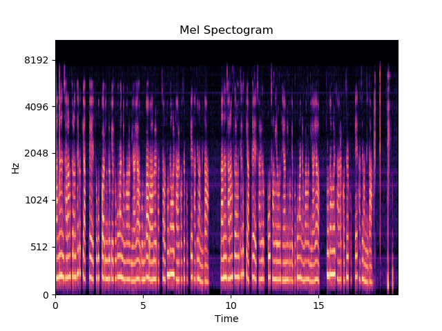
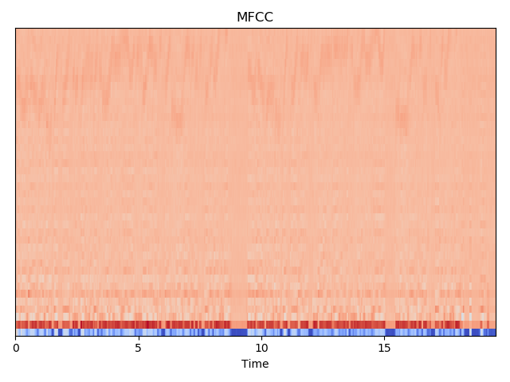
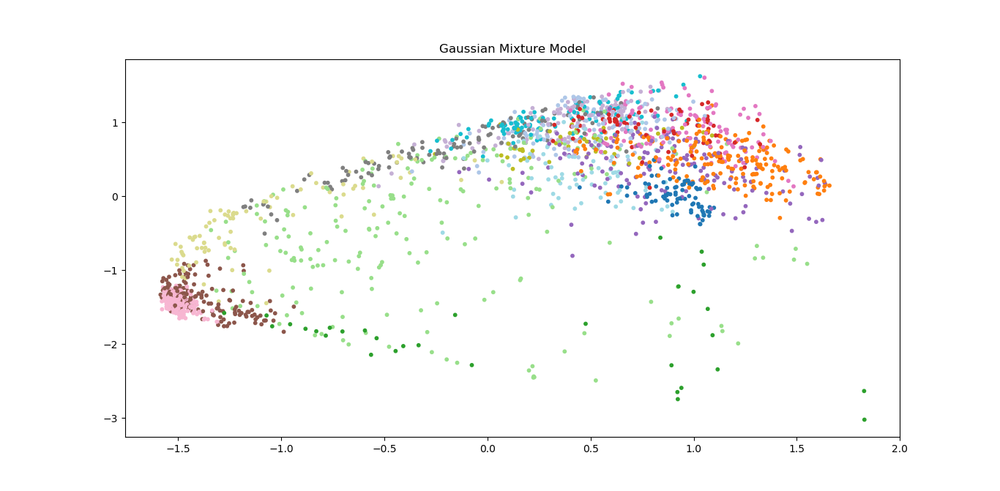
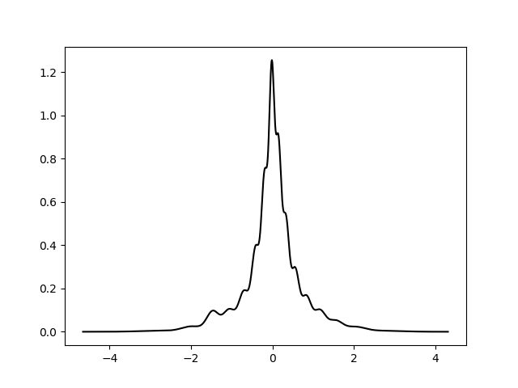

# Digital Sound module2

## Introduction
This project is a module #2 of Digital Sound lecture: Speaker Recognition  

## Learning Objective
Implementing voice recognition that is used in AI speakers 

## Content

### Topic
Recognizing speaker's voice

### Principle & Theory
Distinguishing Speaker's voice patterns in that every person have different voice feature.

## Problem
We want to provide personal service for each family member by using AI speaker using **Speaker Recognition**.  

### Setting data
* Collect 12 students' audio data. Each of the audio data has to read the given script and record with coolEdit(WAV, 16000Hz, 16-bit, mono).
* After collecting the data, use them as training data. 
* All data will be shared with classmates.  

**All data that have used for training models will NOT be OPENED to PUBLIC due to privacy issues**

---
## Solution
I have looked up the code from this [blog](https://appliedmachinelearning.blog/2017/11/14/spoken-speaker-identification-based-on-gaussian-mixture-models-python-implementation/) and applied to my project.   
Image down below is a flow chart how the code works in total.   

</img>

### Code Description
**train_model.py**  

* Input: folder name of training data 
* Output: speaker_name.gmm

**test_model.py**
* Input: total number of test data and folder name of test data
* Output: identified speaker names
  
**show_all_graphs.py**  
Mel Spectogram, MFCC, GMM graphs.

</img>
</img>
</img>
</img>

#### Minor issues
issues | solutions
---|---  
IO library problems | Sometimes io library has problem with reading wav files. You have to get rid of implicit metadata in a wav file. Using [ffmpeg](www.ffmpeg.org) is one way.  
Unicode problems | Try adding "utf-8" when reading wav files

---

## Library
Mainly used sklearn and speakerfeatures with Python

